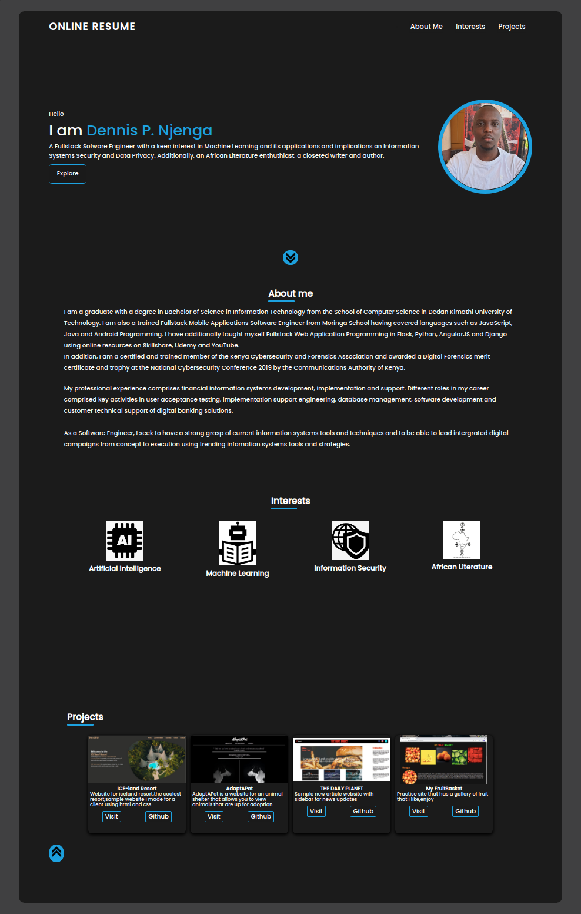

# DENNIS NJENGA LANDING PAGE

### Project Name: ONLINE RESUME

### Project Description
This is my public professional career landing page to serve as an online resume to my profile visitors. Like we say in Swahili, "Ada ya mgeni huonyeshwa njia", which means that it is an acceptable conduct to show a visitor the way. Therefore, karibuni (welcome). 

### Setup Instructions
The operations of the project are fairly straighforward. 
The application makes use of bootstrap as well as a custom CSS file.
Google Chrome is highly recommend to run the program.

* This website requires that you have data access to internet data.

### BDD
* Create HTML forms as primary step.
* For business logic: Use constructors to store input data.
* Use innerHTML to output welcome alerts.
* Create a function that delivers a personal message to my mailbox. 

### Author: [DENNIS NJENGA](https://github.com/deepeters)
### Contact Infomation:
         Email: dennis95peters@gmail.com
         Phone: +254715144831

### Technology Used
1. HTML
2. CSS
3. Javascript

### Frameworks Used
2. Bootstrap 4.5.2
3. jQuery 3.5.1

### Dependancies
1. Git
2. Google Fonts

### LICENSE: [MIT LICENSE](https://raw.githubusercontent.com/deepeters/landing-page/master/LICENSE)

